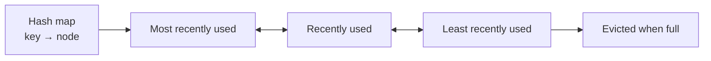

# Thread-Safe LRU Cache

A clean implementation of a **Least Recently Used (LRU) cache** in C++ and Go. Both versions combine a hash map with a doubly linked list to provide constant-time reads, writes, updates, and eviction.

## Highlights

- **O(1) `get` and `put` operations**
- **Automatic LRU eviction** when the cache reaches capacity
- **Thread-safe public operations** using a mutex
- **Generic C++ implementation** for custom key and value types
- Small, runnable examples in both languages

## How it works

The cache uses two cooperating data structures:

1. A **hash map** finds cached entries in O(1) average time.
2. A **doubly linked list** tracks usage order. The front is the most recently used entry, while the back is the least recently used entry.



Reading or updating an entry moves it to the front. Adding an entry to a full cache removes the node at the back.

## Complexity

| Operation | Time | Space |
| --- | ---: | ---: |
| `get` | O(1) average | O(1) |
| `put` | O(1) average | O(1) |
| Complete cache | — | O(capacity) |

## Project structure

```text
LRUCache/
├── Cpp/
│   ├── DoublyLinkedList.hpp
│   ├── LRUCache.hpp
│   └── client.cpp
├── Go/
│   └── LRUCache.go
└── Java/
    └── .gitkeep
```

The `Java` directory is reserved for a future implementation.

## Run the C++ implementation

Requirements: a compiler with C++17 support and thread support.

```bash
cd Cpp
g++ -std=c++17 -pthread client.cpp -o lru_cache
./lru_cache
```

On Windows, run the compiled program with `./lru_cache.exe` or `.\lru_cache.exe`.

### C++ usage

```cpp
#include "LRUCache.hpp"

LRUCache<std::string, int> cache(3);

cache.put("one", 1);
cache.put("two", 2);

if (auto value = cache.get("one")) {
    std::cout << *value << '\n';
}
```

`get` returns `std::optional<V>`: a populated value for a cache hit and `std::nullopt` for a miss.

## Run the Go implementation

Requirements: a recent Go installation.

```bash
go run ./Go/LRUCache.go
```

### Go usage

```go
cache := NewLRUCache(3)

cache.Put(1, 10)
cache.Put(2, 20)

if value, found := cache.Get(1); found {
    fmt.Println(value)
}
```

The Go implementation currently stores `int` keys and values. `Get` returns the value together with a boolean indicating whether the key was found.

## Eviction example

For a cache with capacity `3`:

```text
put(A) → put(B) → put(C) → get(A) → put(D)

Before put(D): B [LRU] ← C ← A [MRU]
After  put(D): C [LRU] ← A ← D [MRU]
```

`B` is evicted because accessing `A` made it the most recently used entry.

## Thread safety

Each implementation protects its public cache operations with a mutex:

- C++ uses `std::mutex` with `std::lock_guard`.
- Go uses `sync.Mutex` with deferred unlocking.

This keeps the hash map and linked-list ordering consistent when multiple threads or goroutines access one cache instance. Operations on the same instance are serialized.

## Notes

- Construct caches with a positive capacity.
- The C++ implementation requires C++17 because it returns `std::optional` from `get`.
- The example programs demonstrate insertion, lookup, updating, and least-recently-used eviction.

## Contributing

Contributions are welcome. Possible next steps include a Java implementation, unit tests, configurable eviction callbacks, and additional concurrency benchmarks.
